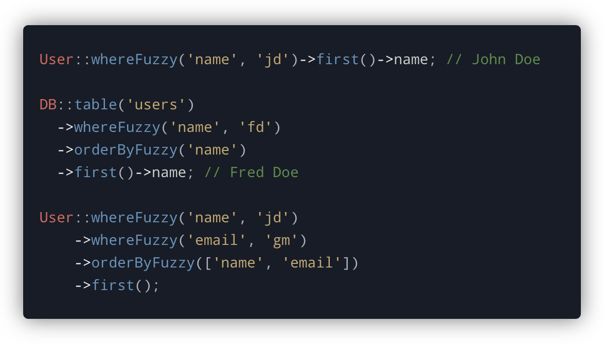

<!-- Screenshot -->
<p align="center">
    
</p>

<!-- Badges -->
<p align="center">
  
</p>

# Fuzzyness

This package is based on "Quest" by mattkingshott

## What is different?

* Fuzzyness does not keep track of the total "fuzzy score" of all your "whereFuzzy" calls. 
   * **Reason**: Not keeping track of total fuzzy score speeds up the querying in a database with 100k+ records by a lot. The downside is that ordering by total fuzzy score is not built-in 
* Option to add a custom list of matchers
* Option to use the full list of preset matchers or a slimmed down version


## About the package

This package enables pseudo fuzzy-searching within Laravel database and Eloquent queries. Due to its pattern matching methods, it only supports **MySQL** or **MariaDB**, though I welcome any PRs to enable support for databases like Postgres.

Much of this library is based on the fantastic work of Tom Lingham for the now abandoned [Laravel Searchy](https://github.com/TomLingham/Laravel-Searchy) package. If you're interested in the background of how the fuzzy searching works, check out the readme for that project.

## Installation

Pull in the package using composer

```bash
composer require tomtruyen/Fuzzyness
```

## Usage

Fuzzyness automatically registers a service provider containing several macros. These macros are then attached to the underlying `Illuminate\Database\Query\Builder` class.

### Filtering results

You can perform a fuzzy-search by calling the `whereFuzzy` method. This method takes three parameters. The first, is the field name. The second, is the value to use for the search e.g., the third is "extended" (default: false). Extended uses all prebuild Matchers but is slower than the non-extended version, but for more specific or accurate results it is advised to set this to ```true```

```php
DB::table('users')
  ->whereFuzzy('name', 'jd', false) // matches John Doe
  ->first();

User::whereFuzzy('name', 'jd', false) // matches John Doe
    ->first();
```

You can also perform a fuzzy search across multiple columns by chaining several `whereFuzzy` method calls:

```php
User::whereFuzzy('name', 'jd', false)  // matches John Doe
    ->whereFuzzy('email', 'gm', false) // matches @gmail.com
    ->first();
```

You can also choose to pass your own list of "Matchers" for if you want to use a custom matcher or a custom list of existing matchers.

**Note:** You must also pass the score for when a field matches with the matcher

```php
DB::table('users')
  ->whereCustomFuzzy('name', 'jd', [StartOfWordsMatcher::class => 35]) // matches John Doe
  ->first();

User::whereCustomFuzzy('name', 'jd', [StartOfWordsMatcher::class => 35]) // matches John Doe
    ->first();
```

### List of preset matchers with scores

```php
array $matchers = [
    ExactMatcher::class                 => 100,
    StartOfStringMatcher::class         => 50,
    AcronymMatcher::class               => 42,
    ConsecutiveCharactersMatcher::class => 40,
    StartOfWordsMatcher::class          => 35,
    StudlyCaseMatcher::class            => 32,
    InStringMatcher::class              => 30,
    TimesInStringMatcher::class         => 8,
];
```

### Ordering results

When using Fuzzyness, a `'relevance_*'` column will be included in your search results. The `*` is a wildcard that will be replaced with the name of the field that you are searching on e.g.

```php
User::whereFuzzy('email', 'gm') // relevance_email
```

This column contains the score that the record received after each of the fuzzy-searching pattern matchers were applied to it. The higher the score, the more closely the record matches the search term.

Of course, you'll want to order the results so that the records with the highest score appear first. To make this easier, Fuzzyness includes an `orderByFuzzy` helper method that wraps the relevant `orderBy` clauses:

```php
User::whereFuzzy('name', 'jd')
    ->orderByFuzzy('name')
    ->first();

// Equivalent to:

User::whereFuzzy('name', 'jd')
    ->orderBy('relevance_name', 'desc')
    ->first();
```

If you are searching across multiple fields, you can provide an `array` to the `orderByFuzzy` method:

```php
User::whereFuzzy('name', 'jd')
    ->whereFuzzy('email', 'gm')
    ->orderByFuzzy(['name', 'email'])
    ->first();

// Equivalent to:

User::whereFuzzy('name', 'jd')
    ->orderBy('relevance_name', 'desc')
    ->orderBy('relevance_email', 'desc')
    ->first();
```

## Limitations

It is not possible to use the `paginate` method with Fuzzyness as the relevance fields are omitted from the secondary query that Laravel runs to get the count of the records required for `LengthAwarePaginator`. However, you can use the `simplePaginate` method without issue or a combination of `skip` and `take`. In many cases this a more preferable option anyway, particularly when dealing with large datasets as the `paginate` method becomes slow when scrolling through large numbers of pages.

## Contributing

Thank you for considering a contribution to Fuzzyness. You are welcome to submit a PR containing improvements, however if they are substantial in nature, please also be sure to include a test or tests.

## Support the project

If you'd like to support the development of Fuzzyness, then please consider [sponsoring me](https://www.paypal.com/cgi-bin/webscr?cmd=_s-xclick&hosted_button_id=YBEHLHPF3GUVY&source=url). Thanks so much!

## License

The MIT License (MIT). Please see [License File](LICENSE.md) for more information.
